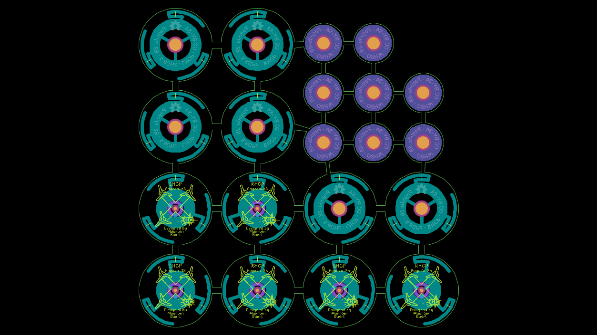

# Pagoda-2-panel
This projekt contains the gerber files for a panel with parts for 6 Pagoda 2 antennas.
3 x RHCP
3 x LHCP

The original files came from Maarten Baert http://www.maartenbaert.be/quadcopters/antennas/pagoda-antenna/
I did the paneling and changes to the silkscreen.

This is a picture of how the panel looks like: 

Licencse CC BY-SA 4.0
